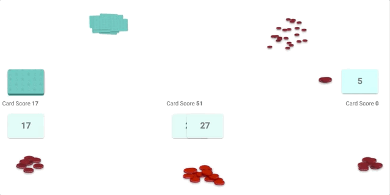

boardgame is a work-in-progress package that aspires to make it easy to define multi-player boardgames that can be easily hosted in a high-quality web app with minimal configuration.

You formally define the rules and logic of your boardgame in **Go** by defining a state object and a series of moves that can be made. You also define a simple **Lit 3 web component** that renders a given game state client-side.

boardgame is under active development as a hobby project and different components of it vary in their completeness and polish.

## Getting started

A comprehensive getting started guide, including a walkthrough of all of the important concepts in a real-world example, is in the [tutorial](https://github.com/jkomoros/boardgame/blob/master/TUTORIAL.md).

## Demo

## Design Goals

- **Don't Repeat Yourself** Write your normative logic that defines your game in Go a single time.
- **Minimize Code** Writing your game should feel like just transcribing the rules into a formal model, not like a challenging coding exercise. 
- **Batteries Included** Common operations, like "deal cards from the draw stack to each player's hand until each player has 3 cards" should require barely any logic to accomplish.
- **Minimize Boilerplate** Structs with powerful defaults to anonymously embed in your structs, and easy-to-use code generation tools where required
- **Clean Layering** If you don't like the default behavior, override just a small portion to make it do what you want
- **Flexible** Powerful enough to model any real-world board or card game
- **Make Cheaters' Lives Hard** Don't rely on security by obscurity to protect secret game state: sanitize properties before transmitting to the client
- **Identify Errors ASAP** If you've configured something incorrectly, ideally it's found either by the type checker or at the moment the program boots up, not later when someone's playing a game. The library is designed to minimize `interface{}`, allowing you to rely on the type system as much as possible, and many common configuration errors will be detected and reported when you call `NewGameManager`.
- **Fast** Minimal reliance on features like reflection at runtime
- **Minimize Javascript** Most client-side views are 10's of lines of templates and databinding, sometimes without any javascript at all
- **Rich animations and UI** Common operations like cards moving between stacks should make use of flexible, fast animations computed automatically
- **Robust tooling** A swiss-army-knife utility called `boardgame-util` makes it easy to generate boilerplate code, generate starter projects, run development servers, make sure the database is structured well, and more.

## Status

The library is currently relativley full-featured. Here are a few of the known gaps (and the issues that track their status):

- **Support of Multiple Browsers** (Issue #394) Currently the web-app only fully works in Chrome, with support for animations in Safari, and with limited testing in other browsers
- **More Contorl over Animations** (Issue #396) Currently moves that are applied one after another don't pause to allow animations to play
- **Examples with a board** None of the example games in the main repo use a board, which means that tools aimed at board-based-games aren't fleshed out
- **Smooth Upgrading** (Issue #184) If you change the shape of the state objects in your game, there's currently no way to handle older versions of the game stored in your database.

Many more small things are still rough or not implemented. Please file issues or comment on existing issues in the tracker for things you're missing!

### Recent Updates

**Lit 3 Migration (February 2026):** The frontend has been migrated from Polymer 3 to modern Lit 3 with TypeScript support. All example games have been updated. External games will need to be migrated - see [server/static/GAME_RENDERER_MIGRATION.md](server/static/GAME_RENDERER_MIGRATION.md) for a complete guide and [server/static/BREAKING_CHANGES.md](server/static/BREAKING_CHANGES.md) for breaking changes.

